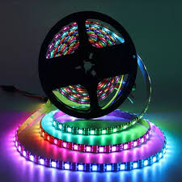

# Ceiling Lights

## Raspberry PI project to control SK6812 RGBW led strips in the ceiling

We live in a dark A-Frame home in the woods with very little lighting. 
I installed LED strips in the ridge of the roof all across the length of the house to add light evenly throughout the house. 
There are 2 zones under the roof: 
- a 5 meter (16.4ft) bedroom;
- a 7.5 meter (24.6ft) loft;

Each zone has 2 continues LED strips installed in parallel to each other and both are controlled with a Raspberry PI.  The signal lines in each zone are tied together at this point and thus they work as clones at this point, but the goal is to make them individually addressable at some point when I get far enough with the software to split them up. 

Also, the strips are being controlled by Raspberry PIs but a couple power outages have painfully highlighted that this cannot be a permanent setup.  A few SD card corruptions and the PI's taking a couple minutes to boot before my light service becomes available on the machines are some decent points to decide to eventually move the control to some more rigid hardware like the ESP32 or similar high performant microcontroller. 

A small battery backed UPS (*Uninterruptible Power System*) system and some 'smarts' might be able to deal with power outages and reduce or prevent future SD card corruptions but a more convincing reason for switching to a non-ROS (*Real-time Operating System*) is that the Raspberry PI runs Linux (which is GREAT!!!!) and that means that it needs to handle tons and tons of overhead to deal with multi-tasking and keeping the system running as smoothly as possible and as democratic as possible (even when running it headless (without graphical desktop) like I always do).  
We can configure thread priorities and all that good stuff, but it's simply not enough to get all the cycles and timing that our app needs to deal with the complex and critical I/O signalling that is required for super fast LED controlling.  
We can achieve some interesting colorful animations through the Raspberry PI but we'll have to switch to another platform if we want very fast and responsive effects.  
I have a couple ESP32-S2's in the pipeline as successors.

Until then, this Python project deals with 1 or 2 ordinary light switches to turn the LED strips on or off (white light; full brightness).  No special effects just yet. 
 

